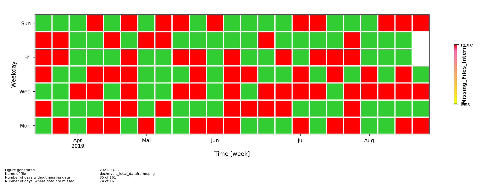
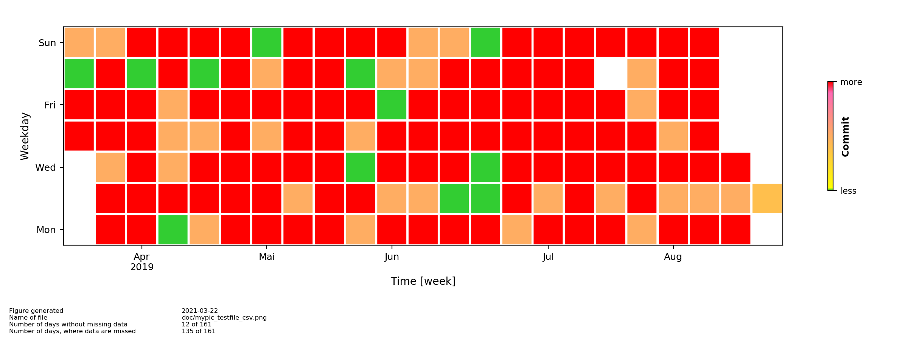

[](https://creativecommons.org/licenses/by-sa/4.0/)
# Create Heatmap of missing files

The repo contains a python3 module to visualize subjects (e.g. missing files) - hereafter refered as data - in a heatmap with daily resolution.

## Description and objective
The repo contains a python3 module to visualize data in a heatmap with daily resolution.

The software package is written to visualize data similar to the
[github contribution chart](https://help.github.com/en/github/setting-up-and-managing-your-github-profile/viewing-contributions-on-your-profile).

*Example 1: The provided data has a single entry (row) per day.*

*Example 2: The provided data has muliple entries per day and a day can have no, a few or exclusiv missing files.*

## Assumptions and notes
This package is **not prepared for collecting** the data.
This package is **prepared for visualization** only.


**Input**

The data can be provided in two different ways:
* **data_input_type = CSV** as two column comma separated csv-file, with a single line header with the names of the columns
    * the data column1 should be consists of a date or a datetime string
    * the data column2 should be a float or a integer value
      * recommendation: use value *0* if file is NOT missing and value *1* if file is missing
    * e.g.:

```
date,missing files
2020-01-18 00:00:00, 1
2020-01-18 10:00:00, 1
2020-01-20 00:00:00, 0
2020-01-21, 1
2019-12-18 01:00:00, 0
2020-01-21 10:00:00, 0
2020-01-21 10:00:00, 0
2020-01-25 10:00:00, 1
2020-01-30 10:00:00, 0.5
```

* **data_input_type = DataFrame** as pandas DataFrame
    * the values in the column1 'date' should be a dtype: datetime64[ns]
    * the values in the second column shouls be float or integer
        * recommendation: use value *0* if file is NOT missing and value *1* if file is missing


In general
* the provided data can contain gaps and
* the provided data can be un-sorted in terms of date or datetime.
* the title (e.g.: Missing files) at the colorbar displays the column(2of2) name of your DataFrame or your csv-file


**Output**

The script generates a Heatmap of missing files. The Heatmap will be provided
* as rendered png-file and additionally
* as html-file using the javascript highcharts library.

## Requirements

* Python version 3.x
* numpy
* pandas
* datetime
* platform
* os
* matplotlib


## Usage

There are two options to take your data.

... see also python script ```plthtmp.py```

```
import PlotHeatmap


# OPTION1: used data are imported from csv file
PlotHeatmap.main(
    {
    'data_import_type' : 'CSV', # Test|DataFrame|CSV
    'picture_filename' : 'test/mypic_testfile_csv',
    'csv_filename'     : 'test/test_missing_files.csv'
    }
)

# OPTION2: used data are provided as panda DataFrame
PlotHeatmap.main(
    {
    'data_import_type' : 'DataFrame', # Test|DataFrame|CSV
    'picture_filename' : 'test/mypic_external_dataframe',
    'DataFrame'        : df
    }
)
```

## Author
* Rico Hengst  [https://orcid.org/0000-0001-8994-5868](https://orcid.org/0000-0001-8994-5868)

## Copyright and license

This application is free software, licensed under CC-BY-SA. The copyright (c) 2020 belongs to Rico Hengst.
